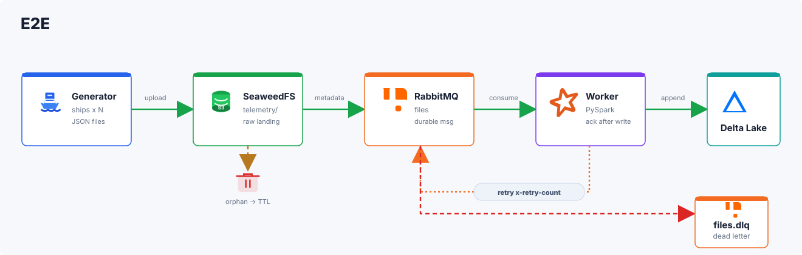
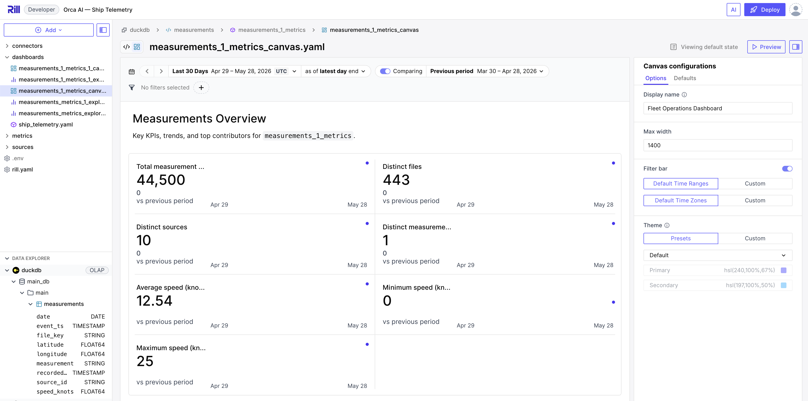

# Ship Telemetry Ingestion Pipeline

A production-grade data pipeline that ingests GPS sensor telemetry from a fleet of ships, transforms JSON payloads into columnar Delta Lake format, and exposes the data for analytics.

## Architecture

[](docs/diagram/pipeline.html)

📄 [Design document — architecture, tool choices, failure handling, trade-offs](docs/design/design.md)

| Requirement | Detail |
|---|---|
| **Latency** | Up to 10–15 minutes end-to-end |
| **Scale** | Multiple ships dumping concurrently, parallel processing |
| **Parallel processing** | Files from different ships processed concurrently |
| **Volume** | Variable and unpredictable file sizes (small · medium · large), uneven distribution across time and sources |
| **Data completeness** | All source records must reach the warehouse — no silent drops |
| **Resource efficiency** | Pipeline must not waste compute or storage |
| **Error handling** | Failures at any stage must not cause data loss |
| **Schema validation** | Pipeline must tolerate schema changes gracefully |

📋 [Requirements proof — live test results against the running pipeline](docs/requirements-proof.md)

> "The most critical aspect is designing for parallel processing and large scale, the pipeline must handle many concurrent ships, variable file sizes, and bursty loads while guaranteeing that no data is lost."

📄 [Scalability & reliability analysis — how the pipeline meets this requirement](docs/design/scalability.md)

⚠️ [Known gaps — what was deferred and why](docs/design/gaps.md)

📊 [Analytics dashboards — how to view the Fleet Operations dashboard](docs/analytics.md)

[](docs/analytics.md)

---

## Prerequisites

### macOS

| Dependency | Minimum version | Install |
|---|---|---|
| Docker Desktop | 4.x | [docs.docker.com/desktop/mac](https://docs.docker.com/desktop/mac/install/) |
| Docker Compose | v2 (bundled) | Included with Docker Desktop |
| Python | 3.10+ | `brew install python` or [python.org](https://python.org) |
| Git | any | `brew install git` |

**Docker Desktop resource settings** (required for the worker's Spark JVM):

1. Open Docker Desktop → Settings → Resources
2. Set **Memory** to at least **6 GB** (8 GB recommended)
3. Set **CPUs** to at least **4**
4. Click **Apply & Restart**

### Windows

| Dependency | Minimum version | Install |
|---|---|---|
| Docker Desktop | 4.x (WSL2 backend) | [docs.docker.com/desktop/windows](https://docs.docker.com/desktop/windows/install/) |
| WSL2 | - | `wsl --install` in PowerShell (Admin) |
| Docker Compose | v2 (bundled) | Included with Docker Desktop |
| Python | 3.10+ | [python.org/downloads](https://www.python.org/downloads/) or `winget install Python.Python.3.12` |
| Git | any | [git-scm.com](https://git-scm.com/download/win) or `winget install Git.Git` |

**WSL2 memory limit** — by default WSL2 can consume all available RAM. To cap it, create or edit `%USERPROFILE%\.wslconfig`:

```ini
[wsl2]
memory=8GB
processors=4
```

Then restart WSL: `wsl --shutdown` in PowerShell.

**Docker Desktop resource settings** — same as macOS: Settings → Resources → set Memory ≥ 6 GB.

**All commands below work in PowerShell, CMD, or WSL2 bash.** If you use CMD or PowerShell, replace the `\` line-continuation character with `` ` `` (PowerShell) or `^` (CMD).

---

## Quick Start

```bash
# 1. Clone the repository
git clone git@github.com:somerl20/london-orca-ai.git
cd london-orca-ai

# 2. Start the core pipeline (generator + broker + worker + object store)
docker-compose up
```

That's it. The generator starts producing ship files immediately. The worker consumes and transforms them into Delta Lake.


---

## Service URLs & Credentials

| Service | URL | Credentials |
|---|---|---|
| RabbitMQ Management UI | http://localhost:15672 | `guest` / `guest` |
| SeaweedFS S3 API | http://localhost:8333 | `any` / `any` |
| SeaweedFS Filer | http://localhost:8888 | — |
| Prometheus | http://localhost:9090 | — |
| Rill (Fleet Dashboard) | http://localhost:3030 | — |

---

## Generator Configuration

The generator simulates a fleet of ships. It is configured via environment variables in `docker-compose.yml`. To change the defaults without editing the file, pass them on the command line:

```bash
# 20 ships, medium-sized files, 1 file/min
docker-compose up -e SOURCES=20 -e SIZE=medium -e RATE=1

# Large files to stress-test chunking
docker-compose up -e SIZE=large -e RATE=0.5
```

| Variable | Default | Description |
|---|---|---|
| `SOURCES` | `10` | Number of distinct ship IDs |
| `RATE` | `2` | Files published per minute |
| `SIZE` | `small` | `small` (~15 KB) · `medium` (~5 MB) · `large` (~45 MB) |
| `RATE_JITTER` | `0.3` | Random ± fraction applied to the interval between files |
| `SIZE_RANDOM` | `false` | If `true`, each file picks a random size tier |
| `S3_BUCKET` | `telemetry` | Target S3 bucket in SeaweedFS |
| `RABBITMQ_QUEUE` | `files` | Queue where file keys are published |

**File example** — `ship-42_gps_2026-05-23T10:14:00Z.json`:

```json
[
  {
    "source_id": "ship-42",
    "measurement": "gps",
    "timestamp": "2026-05-23T10:14:00Z",
    "values": {
      "lat": 32.08,
      "lon": 34.78,
      "speed_knots": 12.4
    }
  }
]
```

### Running the generator locally (without Docker)

Requires Python 3.10+, no extra packages:

```bash
# macOS / Linux / WSL2
python generator/src/generator/generator.py \
  --output-dir ./input \
  --rate 2 \
  --size small \
  --sources 10

# Windows PowerShell
python generator\src\generator\generator.py `
  --output-dir .\input `
  --rate 2 `
  --size small `
  --sources 10
```

---

## Scaling Workers

Workers consume from RabbitMQ in parallel. Scale horizontally to increase throughput:

```bash
# Start 3 workers
docker-compose up --scale worker=3

# Scale up while the pipeline is already running
docker-compose up --scale worker=5 --no-recreate
```

Each worker runs its own PySpark session and writes to Delta Lake concurrently. Delta's optimistic concurrency control handles simultaneous appends safely.

---

## Validating Data in the Warehouse

### Option 1 — query script inside a running worker container

```bash
# Find the worker container name
docker-compose ps

# Run the validation script
docker exec -i london-orca-ai-worker-1 python - < scripts/query_measurements.py 
```

The script prints:
- Schema of the `measurements` table
- Total row count
- 10 most recent rows
- Row count per ship
- Average and max pipeline lag (event timestamp → recorded timestamp)


### Option 2 — raw SQL queries

Sample queries are in [`analytics/queries/`](analytics/queries/):

- [`ships.sql`](analytics/queries/ships.sql) — per-ship row counts and latest event
- [`pipeline_health.sql`](analytics/queries/pipeline_health.sql) — lag metrics


## Running Tests

See [docs/testing.md](docs/testing.md) for the full test strategy, setup instructions, and how to run each layer.

---

## Continuous Integration - CI

CI runs on every `git commit` via a pre-commit hook. It executes the fast test suite (`pytest -m "not slow"`) — unit tests and in-process E2E tests that need no Docker. The commit is blocked if any test fails. Slow tests (Docker-based resilience and real-broker tests) can be run manually; see [docs/testing.md](docs/testing.md).

---

## Repository Layout

See [docs/layout.md](docs/layout.md).

---

## Failure Handling

| Failure scenario | Behaviour |
|---|---|
| Worker crashes mid-processing | RabbitMQ redelivers the message (no ack sent). Worker retries up to `RETRY_MAX` times on restart. |
| Malformed JSON or schema mismatch | Message is nacked and retried; after `RETRY_MAX` retries it is routed to `files.dlq` for inspection. |
| SeaweedFS temporarily unavailable | Worker retries with backoff; RabbitMQ message stays unacked until the download succeeds or the retry limit is reached. |
| RabbitMQ restart | Queues are durable; messages survive broker restarts. Workers reconnect automatically via `pika` retry logic. |
| Duplicate file delivery | The worker checks a `_processed_files` Delta table before writing; already-processed keys are skipped. |
| Delta concurrent write conflict | PySpark/Delta optimistic concurrency detects conflicts and retries the affected transaction. |

---

## Troubleshooting

See [docs/troubleshooting.md](docs/troubleshooting.md).

---

## Stopping and Cleaning Up

```bash
# Stop all containers
docker-compose down

# Stop and remove all volumes (deletes all ingested data)
docker-compose down -v
```
